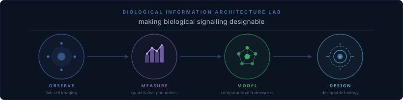

# Biological Information Architecture Lab
**Vanderbilt University** · [bia-lab-team.github.io](https://bia-lab-team.github.io/BIA_Lab_Website/)
<div align="center"></div>

> We are building the science to make biological signaling **designable** — to move tissues from something we observe to something we can specify, predict, and engineer.


[](https://bia-lab-team.github.io/BIA_Lab_Website/join.html)

---

## Tools

All tools are freely available and designed to compose — they share data structures and coordinate conventions so that segmentation, parameterisation, phenotyping, and information-flow analysis can be chained into end-to-end pipelines.

### Group 1 · Quantitative Cell Phenomics & Motion Analysis

| Tool | Description | Repo | Paper |
|------|-------------|------|-------|
| **SAM-SPOT** `PyPI` | Three-stage pipeline — video segmentation, SAM phenome computation, unsupervised clustering — for characterising dynamic cells and organoids in time-lapse imaging. Interpretable cross-experiment phenotype comparison. | [fyz11/SPOT](https://github.com/fyz11/SPOT) | [*Nat. Commun.* 2026](https://doi.org/10.1038/s41467-026-75505-8) |
| **MOSES** `PyPI` | Superpixel optical-flow framework for quantifying collective motion phenotypes in time-lapse microscopy without single-cell tracking. Constructs motion meshes and extracts boundary and flow statistics. | [BIA-Lab-Team/MOSES](https://github.com/BIA-Lab-Team/MOSES) | [*eLife* 2019](https://elifesciences.org/articles/40162) |
| **u-Unwrap** `PyPI` | Maps 2D cell shapes to canonical disk and rectangular coordinate systems via conformal, equiareal, and equidistant parameterisation. Enables spatiotemporal registration and ML-ready representations of membrane signals. | [DanuserLab/u-unwrap](https://github.com/DanuserLab/u-unwrap) | [OpenReview](https://openreview.net/forum?id=jUmTewPzII) |

### Group 2 · 3D Cell Imaging & Segmentation

| Tool | Description | Repo | Paper |
|------|-------------|------|-------|
| **u-segment3D** `PyPI` | Generates robust 3D instance segmentations by merging 2D slice-by-slice predictions from orthogonal xy/xz/yz views. Compatible with any 2D engine (e.g. Cellpose) — no 3D retraining required. | [DanuserLab/u-segment3D](https://github.com/DanuserLab/u-segment3D) | [*Nature Methods* 2025](https://www.nature.com/articles/s41592-025-02887-w) |
| **u-protrude3D** `PyPI` | Detects and labels individual protrusions (blebs, filopodia, microvilli, lamellipodia) on triangulated cell surface meshes by inferring an optimal basal reference surface via conformalized mean curvature flow. Benchmarks against ground truth and volumises surface labels into 3D voxel volumes. | [DanuserLab/u-protrude3D](https://github.com/DanuserLab/u-protrude3D) | *Forthcoming* |
| **u-Unwrap3D** `PyPI` | Transforms 3D cell surface meshes into canonical representations — topographic maps, spherical parameterisations, unfolded 2D images — via conformalized mean curvature flow. Quantitative analysis of 3D membrane-associated signals. | [DanuserLab/u-unwrap3D](https://github.com/DanuserLab/u-unwrap3D) | [bioRxiv 2023](https://www.biorxiv.org/content/10.1101/2023.04.12.536640) |

### Group 3 · Information Flow Analysis

| Tool | Description | Repo | Paper |
|------|-------------|------|-------|
| **u-infotrace** | Multiscale pixel-to-pixel spatiotemporal information flow analysis using formal causal measures. Complements optical flow with information-theoretic signal propagation; applicable across developmental biology and collective migration. | [DanuserLab/u-infotrace](https://github.com/DanuserLab/u-infotrace) | [OpenReview](https://openreview.net/forum?id=4P0qQrU_SlN) |
| **v-InfoTrace** `PyPI` | Successor to u-infotrace, extended with multichannel (cross-channel, confound-aware) causal flow and a 3D+time generalisation of the full pipeline; provides five interchangeable causal measures (DDC, LK flow, correlation, PCCA, GC). | [BIA-Lab-Team/v-InfoTrace](https://github.com/BIA-Lab-Team/v-InfoTrace) | *Forthcoming* |
| **v-TimeLKFlow** `PyPI` | Time-varying, multivariate Liang–Kleeman information flow via Kalman-filter estimation — tracks directed causal-flow strength between time series as a continuous, time-indexed estimate rather than a single static verdict. | [BIA-Lab-Team/v-TimeLKFlow](https://github.com/BIA-Lab-Team/v-TimeLKFlow) | *Forthcoming* |

### Quick install

```bash
# Group 1 — cell phenomics & motion
pip install SAM-SPOT           # SAM-SPOT (2D/3D phenotyping)
pip install u-Unwrap            # u-Unwrap (2D shape normalisation)
pip install v-MOSES             # MOSES (collective motion phenotyping)

# Group 2 — 3D imaging & segmentation
pip install u-Segment3D         # u-segment3D (3D consensus segmentation)
pip install u-Protrude3D        # u-protrude3D (3D protrusion detection & volumisation)
pip install u-Unwrap3D          # u-Unwrap3D (3D surface parameterisation)

# Group 3 — information flow analysis
pip install git+https://github.com/DanuserLab/u-infotrace.git
pip install v-InfoTrace         # v-InfoTrace (multichannel/3D causal information flow)
pip install v-TimeLKFlow        # v-TimeLKFlow (time-varying causal information flow)
```

---

## Selected publications

| Tool / topic | Paper | Journal |
|---|---|---|
| u-segment3D | [Universal consensus 3D cell segmentation](https://www.nature.com/articles/s41592-025-02887-w) | *Nature Methods* 2025 |
| SAM-SPOT *(methods)* | [Development of a universal imaging phenome using shape, appearance and motion (SAM) features and the SAM Phenotype Observation Tool (SPOT)](https://doi.org/10.1038/s41467-026-75505-8) | *Nature Communications* 17:8409 · 2026 |
| SAM-SPOT (organoids) | [Identifying phenotype-genotype-function coupling in 3D organoid imaging using SPOT](https://doi.org/10.1038/s41467-026-75506-7) | *Nature Communications* 17:8410 · 2026 |
| u-Unwrap | [Mapping cell morphology to a standard coordinate system for analysing dynamic cell signaling](https://openreview.net/forum?id=jUmTewPzII) | NeurIPS Workshop 2025 |
| u-infotrace | [Multiscale pixel spatiotemporal information flows](https://openreview.net/forum?id=4P0qQrU_SlN) | NeurIPS Workshop 2022 |
| MOSES | [Collective cell migration phenotypes via motion sensing superpixels](https://elifesciences.org/articles/40162) | *eLife* 2019 |
| u-Unwrap3D | [Surface-guided computing to quantify dynamic interactions between cell morphology and molecular signals in 3D](https://www.biorxiv.org/content/10.1101/2023.04.12.536640) | bioRxiv 2023 |
| Spatial tissue profiling | [Highly multiplexed 3D CyCIF profiling of cell states and immune niches in human tumors](https://www.nature.com/articles/s41592-025-02824-x) | *Nature Methods* 2025 |

Full list → [bia-lab-team.github.io/publications](https://bia-lab-team.github.io/BIA_Lab_Website/publications.html) · [Google Scholar](https://scholar.google.com/citations?user=iRTxWEMAAAAJ)

### Patents

| Number | Title | Inventors | Year | Status |
|--------|-------|-----------|------|--------|
| [WO2024100225A1](https://patents.google.com/patent/WO2024100225A1/) | Methods and systems for characterizing morphodynamic profiles of objects | Zhou FY, Lu X | 2024 | pending |
| [US 11,748,885](https://patents.google.com/patent/US11748885B2/en) | Methods and systems for analyzing time ordered image data | Zhou F, Lu X, Ruiz-Puig C, Rittscher J | 2023 | granted |
| [US 12,249,065](https://patents.google.com/patent/US12249065B2/en) | Quality assessment in video endoscopy | Rittscher J, Ali S, Bailey A, East JE, Braden B, Zhou F, Lu X | 2025 | granted |

*Patents were filed under prior institutional affiliations (University of Oxford / Ludwig Institute for Cancer Research).*

---

## Public datasets

Companion datasets for our papers are openly available on Zenodo and Mendeley Data.

- [u-segment3D example data](https://zenodo.org/records/15692302) — 3D light-sheet microscopy volumes (Zenodo)
- [SGTO datasets](https://zenodo.org/records/14265519) — spatiotemporally-grounded tissue ontology (Zenodo)
- [MPEG-7 / Brodatz texture benchmark](https://zenodo.org/records/20648294) (Zenodo)
- [EAD 2019 endoscopy artefact detection dataset](https://data.mendeley.com/datasets/c7fjbxcgj9) (Mendeley Data)
- [Normal 2-cell migration dataset](https://data.mendeley.com/datasets/j8yrmntc7x) (Mendeley Data)
- [EGF addition migration dataset](https://data.mendeley.com/datasets/vrhtsdhprr) (Mendeley Data)

Full dataset list → [bia-lab-team.github.io/datasets](https://bia-lab-team.github.io/BIA_Lab_Website/datasets.html)

---

## Join us — founding members

The BIA Lab is brand new. That means the people who join now aren't just joining a lab — they are building one. Founding members will have real ownership over the lab's direction: the problems we tackle, the tools we build, the culture we create. If you want to help define what a next-generation computational biology lab looks like from the ground up, this is that opportunity.

We are looking for people who want to **derive** quantitative frameworks for cell and tissue biology, not just apply them. Strong mathematical intuition, a taste for large and messy imaging data, and genuine curiosity about why cells behave the way they do are more important to us than a specific prior skill set.

**PhD students** — apply through the [Vanderbilt BRET graduate programs](https://medschool.vanderbilt.edu/bret/) (QCB, IGP, or related tracks). Reach out before applying — we want to talk to you first.

**Postdocs** — email directly with CV, 1-page cover letter, 1-page personal statement (career goals + why the BIA Lab), 2-page research statement, and contact details for 2–3 referees.

**Rotation students** — always welcome. Email to arrange a rotation; no prior connection needed.

→ **[Full details and application instructions](https://bia-lab-team.github.io/BIA_Lab_Website/join.html)** · [felix.y.zhou@vanderbilt.edu](mailto:felix.y.zhou@vanderbilt.edu)

---

[bia-lab-team.github.io](https://bia-lab-team.github.io/BIA_Lab_Website/) · [software](https://bia-lab-team.github.io/BIA_Lab_Website/software.html) · [datasets](https://bia-lab-team.github.io/BIA_Lab_Website/datasets.html) · [publications](https://bia-lab-team.github.io/BIA_Lab_Website/publications.html) · [Google Scholar](https://scholar.google.com/citations?user=iRTxWEMAAAAJ)
